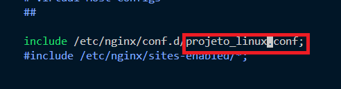

# Servidor NGINX + Amazon AWS EC2

## #Objetivo do Projeto
Criar uma VPC e uma instância EC2 Ubuntu, configurar e subir uma página simples na internet usando o NGINX, e desenvolver um script de monitoramento de disponibilidade do site usando o webhook do Discord.

## #Tecnologias utilizadas
> [!IMPORTANT]
> É necessário possuir uma conta na Amazon AWS e no Discord, ter noções básicas de HTML e possuir o VSCODE instalado na máquina.

- Sistema Operacional da máquina utilizado durante o projeto: Windows 11.
- Recursos Amazon AWS: VPC, Security Goup, Key Pair, Instance EC2 (Ubuntu Server 24.04, t2.micro).
- Webhook Discord.
- VSCode (GitBash - terminal).

### 1. Criando uma VPC 
> [!NOTE]
> A Amazon Virtual Private Cloud (VPC) é uma rede virtual isolada que possibilita usar recursos AWS nela, como as instâncias EC2.

1.1 Procurar e selecionar ***VPC*** no console da Amazon AWS.

1.2 Selecionar ***Create VPC***.

1.3 Selecionar ***VPC and More***; habilitar Auto-generate e inserir o nome de sua VPC; Number of public subnets: 2 (quantidade de subnets públicas da VPC); Number of private subnets: 2 (quantidade de subnets privadas da VPC); selecionar Create VPC.

> [!CAUTION]
> As demais configurações não alteramos.

### 2. Criando e configurando um Security Group
> [!NOTE]
> O security group define o tráfego dos nossos recursos AWS (quem e quais conexões e portas, similiar a um firewall).

2.1 Procurar e selecionar ***EC2*** no console da AWS.

2.2 Selecionar ***Security Groups***. 

2.3 Selecionar ***Create security group***.

2.4 Informar o nome do seu Security Goup em Security group name; inserir a descrição do seu Security Goup em Description; selecionar a VPC que foi criada anteriormente.

2.5 Selecionar ***Delete*** (Outbound Rules).

2.6 Selecionar ***Create security group***.

2.7 Selecionar: ***Inbound rules****; ***Edit Inbound Rules***.
> [!IMPORTANT]
> Tanto inbound quanto outbound rules não aceitam caracteres especiais (ex: "ç") no campo descrição das regras.

2.8 Selecionar ***Add rule***.

2.9 Inserir: Type: SSH; Source: My IP; Description: a descrição da sua regra SSH.
> [!NOTE]
> Essa regra de entrada vai permitir o acesso (apenas para a nossa marquina) da instância EC2 Ubuntu que criarmos pelo VSCode (usando uma par de chaves). 

2.10 Selecionar ***Add rule***, e inserir: Type: HTTP; Port: 80; Source: Anywhere-IPv4; Description: a descrição da sua regra HTTP.
> [!NOTE]
> Essa regra de entrada vai permitir a conexão HTTP de qualquer máquina com a instância EC2 Ubuntu que criarmos pelo VSCode (isso possibilitará o acesso de outras máquina a nossa página no NGINX).

2.11 Selecionar ***Save rules***.

2.12 Selecionar: ***Outbound rules***; ***Edit Outbound Rules***.

2.13 Selecionar ***Add rule***, e inserir: Type: All traffic; Destination: Anywhere-IPv4; Description: a descrição da sua regra de saída.
> [!NOTE]
> Essa regra de saída vai permitir que a instância EC2 que criaremos realizar qualquer tipo de conexão com IPs da versão 4 (vai permitir o acesso de internet para a instância).

2.14 Selecionar ***Save rules***.

### 3. Criando uma Key Pair (par de chaves)
> [!NOTE]
> Criamos um par de chave ".pem" para conectar na instância EC2 Ubuntu pelo VSCode (GitBash) via conexão SSH (conforme criamos a regra no security group).

3.1 Selecionar ***Key Pairs***.
> [!IMPORTANT]
> É necessário estar na página EC2 da Amazon AWS.

3.2 Selecionar ***Create Key Pair***.

3.3 Inserir o nome do seu par de chaves (Name); selecionar o tipo da chave: RSA (Key pair type); selecionar o formato da chave: .pem (Private key..).

3.4 Selecionar ***Create key pair***.
> [!IMPORTANT]
> Após criar o par de chaves, irá ser feito seu download, se atente ao diretório em que a chave está alocada, pois iremos usar elas no processo de conectar na instância.

### 4. Criando uma instância EC2 Ubuntu
> [!NOTE]
> Uma instância EC2 é como se fosse uma VM (virtual machine) dentro da Amazon AWS, ou seja, é o seu servidor. Para realizar as configurações abaixo é necessário estar na página ***EC2***.

4.1 Selecionar ***Instances***.

4.2 Selecionar ***Launch Instances***.
> [!WARNING]
> As configurações de: AMI (Sistema Operacional) e sua versão; tipo de instância; tamanho do volume EBS (armazenamento) e seu tipo  foram escolhidas as opções "Free Tier eligible" (são gratuitas). Porém o uso da instância ao longo do tempo é cobrado, após a prática do projeto a instancia foi deletada ("Terminate Instance").

4.3 Infomar o nome da instância (Name), e selecionar: Quick Start: Ubuntu (é o sistema operacional do servidor); AMI: Ubuntu Server 24.04 LTS (HVM), SSD Volume Type; Architeture: 64 bits ou 32 bits (conforme a configuração da sua máquina); Instance Type: t2.micro (é o tipo da instância); Key pair: a chave que você criou.

4.3 Selecionar ***Edit*** (Network settings).

4.6 Selecionar: VPC: VPC criada; Subnet: qualquer subnet pública; Auto-assign public IP: Enable (a intância vai possuir um IP público e isso vai permitir que qualquer ip consiga acessar nossa página NGINX).

4.7 Selecionar ***Select existing security group***.

4.8 Selecionar o security group criado anteriormente (Commom security groups).

4.9 Inserir o tamanho em GB do armazanemento do seu servidor (1x) e tipo dele (gp3).

4.11 Inserindo Scripts no User Data (OPCIONAL)
> [!NOTE]
> O user data é um campo que fica dentro da página de criação de instâncias EC2 que permite inserir scripts para automatização que serão executados quando iniciarmos na instância que subiremos pela primeira vez.
    
- 4.11.1 Selecionar ***Advanced Details***.
        

    
- 4.11.2 Selecionar ***Choose file*** (e selecionar seu script de automatização) ou colar na caixa de texto o script.
        
> [!IMPORTANT]
> O meu script de automatização do user data, está neste repósitório, na pasta script (_userdata.sh_), caso você use este script basta criar um webhook (etapa 9) e colar sua url no script.
        

> [!WARNING]
> Quem seguir esta etapa pode pular as etapas: 6, 7, 10, 11.

4.11 Selecionar ***Launch instance***.

### 5. Conectando na instância
> [!IMPORTANT]
> Para conectar em uma instância seu "status check" precisa ser "2/2 checks passed".

5.1 Selecionar ***Instances***.
  

5.2 Selecionar instância criada e ***Connect***.

5.3 Selecionar ***SSH Client***, e copiar "chmod..." (SSH Client) e colar no terminal do VSCode (GitBash) + Enter.
> [!WARNING]
> Para realizar esse comando, é necessário estar dentro do diretório onde foi feito o download da chave.

5.5 Copiar "ssh -i..." (SSH Client) e colar no Git Bash + Enter + yes + Enter. 

### 6. Instalando o NGINX

6.1 Executar comandos: `sudo apt-get update` e depois executar `sudo apt-get upgrade -y`.

6.2 Executar comando: `sudo apt-get install nginx -y` (comando para instalar o nginx).

### 7. Configurando o NGINX

7.1 Executar comando: `sudo vi /etc/nginx/nginx.conf`.

7.2 Comentar a linha abaixo:

7.3 Altarar a linha abaixo e salvar o arquivo (comando: ESQ + `:wq`):

> [!NOTE]
> Essa configuração determina em qual diretório vai ficar o arquivo de configuração da nossa página NGINX.

7.4 Executar comando: `sudo vi /etc/nginx/conf.d/projeto_linux.conf`.
> [!NOTE]
> Criando arquivo de configuração da página web.

7.5 Inserir as seguintes configurações e salvar o arquivo.

7.6 Executar comando: `sudo mkdir /var/www/projeto_linux.com`.
> [!NOTE] 
> Criando a pasta da página do site, conforme arquivo de configuração.

7.7 Executar comando: `sudo vi /var/www/projeto_linux.com/index.html`; e inserir o código do seu HTML e salvar.
> [!NOTE]
> Criando a página do site, o meu arquivo index.html (esse arquivo esta na pasta html deste repositório).

7.8 Executar comando: `sudo systemctl restart nginx.service` (reniciando o NGINX).
> [!NOTE]
> A partir de agora o NGINX vai subir nossa página HTML personalizada.

### 8. Acessando nossa página pelo navegador

8.1 Selecionar instância no Console da Amazon AWS; selecionar ***Details***; copiar o IP público da instância (Public IPv4 address).

8.2 Digitar no navegador http://(colar aqui  o ip público da instância)

### 9. Criando um Webhook
> [!IMPORTANT]
> É necessário acessar o site do Discord.

9.1 Selecionar ***Adicionar um servidor***.

9.2 Selecionar ***Criar o meu***.

9.3 Selecionar ***Para meus amigos e eu***.

9.4 Selecionar ***Criar canal***.

9.5 TIPO DE CANAL: Texto; NOME DO CANAL: o nome do que você quiser; selecionar ***Criar canal***.

9.6 Selecionar ***Editar canal***.

9.7 Selecionar ***Integrações***; selecionar ***Criar webhook***; selecionar ***Copiar URL do webhook***.
> [!IMPORTANT]
> A URL do webhoook do discord vai ser o valor da nossa variável "webhook" dentro do script, o que vai possibilitar enviar as mensagens para o canal que criamos no discord.

### 10. Criando e configurando um Script de Monitoramento (Shell Script)

10.1 Executar comando: `sudo vi /usr/bin/monitoramento.sh`.
> [!NOTE] 
> Criando shell script de monitoramento.

10.2 Inserir o código:
> [!IMPORTANT]
> Este código está dentro da pasta script deste repositório.

* `#!/bin/bash` - informa ao linux que o arquivo é um shell script; 

* `sudo curl -s localhost > /var/log/conexao.log` - esse comando esta realizando o teste de conexão com a página personalizada ("localhost" - é o ip da nossa máquina), e toda vez que o script é executado: é criado o arquivo "conexão.log" e inserido o código html da nossa página (se a conexão for realizada com sucesso, caso contrário o arquivo "conexão.log" ficará vazio);

*  `webhook=..` - é a variavel que recebe a url do webhook do discord que copiamos; 

* `data=..` - é a variavel com um formato de data (ex: 20/11/2025 - 05:00:30) que vai aparecer junto da notificação webhook; 

* `if sudo grep -q "<!DOC" /var/log/conexão.log` - essa condição shell script verifica se o arquivo "conexão.log" possui a string "<!DOC" em seu conteúdo, o que significa: conexão feita e servidor web nginx funcionando;

* `msg=..` (é a variável que contém a mensagem de disponibilidade ou não do nginx) - dentro do bloco if recebe uma mensagem positiva de disponibilidade da página, e dentro do bloco else recebe uma mensagem de indisponiblidade/falha do site NGINX;

* `echo $msg >> /var/log/monitoramento.log` - esse comando insere o valor de msg dentro do arquivo monitoramento.log (como o comando usa >>, toda  linha de mensagem vai ser acrescentada dentro do arquivo) toda vez que o script é executado;

* `sudo systemctl restart nginx.service` - esse comando vai reniciar o nginx quando não for possível realizar a conexão com a página html (quando não for encontrado a string "<!DOC" dentro do arquivo "conexão.log");

* `sudo curl -H "Content-Type: application/json" -X POST -d  "{\"content\":\"$msg\"}" "$webhook"` - esse comando envia a nossa mensagem (formato JSON), usando o método de envio de dados POST, para a url do webhook do Discord; esse comando é responsável pela notificação no Discord.

> [!TIP]
> Como inserir um emoji no Discord no código: selecionar o ícone de emoji; procurar um emoji e passar o mouse sobre ele; copiar seu nome (:nome:) e colar dentro da variável msg do seu script. 

10.2 Salvar arquivo e sair.

10.3 Executar comando: `sudo chmod a+x /usr/bin/monitoramento.sh`.

> [!IMPORTANT]
> Este comando concede permissão para todos os usuários do servidor (é esse comando que transforma nosso script em um comando executável).

### 11. Criando e configurando um serviço Systemd
> [!IMPORTANT]
> O serviço Systemd que criaremos tem como objetivo automatizar o script "monitoramento.sh" (o script será executado automaticamente).

11.1 Inserir o comando: `sudo vi /etc/systemd/system/monitoramento.service`.

11.2 Dentro do arquivo "monitoramento.service" as seguintes configurações:
> [!IMPORTANT]
> Este código está dentro da pasta service deste repositório.

* `Description=..` - este parâmetro define a descrição do serviço criado;

* `After=network.target` - este parâmetro define depois "do quê" o serviço será inciado, neste caso o serviço será iniciado após ser carregado as configurações de rede do servidor;

* `Restart=always` (este parâmetro define que o serviço que o servidor será sempre reniciado) e `RestartSec=..` (este parâmetro define o intervalo de tempo que o serviço será reniciado em segundos);

* `ExecStart=..` - este parâmetro define qual script (através de seu caminho) será executado quando o serviço iniciar;

* `WantedBy=multi-user.target` - este parâmetro define quem (usuários) vão possuir este serviço, nesse caso todos os usuários do servidor possuirão acesso ao serviço criado.

11.3 Salvar arquivo e sair.

11.4 Executar comando: `sudo systemctl daemon-reload`.
> [!IMPORTANT]
> Este comando atualiza o systemd (reposável pelos serviços das distribuições linux), com isso o systemd vai criar o monitoramento.service.

11.5 Executar comando: `sudo systemctl enable monitoramento.service`.
> [!IMPORTANT]
> Agora o serviço monitoramento.service inicia junto do boot servidor.

11.6 Executar comando: `sudo systemctl start monitoramento.service` (inciando o serviço).

### 12. Testando Serviço de monitoramento NGNIX.
> [!TIP]
> Para realizar os testes abra as 3 janelas (site no navegador, gitbash( use o comando `sudo systemctl status nginx.service` para vizualizar a disponibilidade do nginx) e o canal de monitoramento do discord). Caso: a página no navegador atualize e volte a funcionar automaticamente; ou "Active= active (running)" no status do nginx; ou uma notificação "Requisição feita.." no serviço de monitoramento automatico; o  nginx está fucionando corretamente.

12.1 Inserir comando: `sudo systemctl stop nginx.service` (parando o serviço do NGINX).

12.2 Inserir comando: `sudo killall nginx` (matando todos os processos do NGINX).

### #Conclusão
O projeto teve como objetivo de criar uma instância na nuvem (AWS) e subir um site nela com o Nginx, com o uso de webhooks  para o monitoramento da página html usando um script shell. Podemos concluir que este projeto é um pontapé inicial e proporciona de forma mais simples o funcionamento de serviços/aplicações na nuvem e seus recursos.

